```mermaid
graph TB
    %% Global DNS and User Access
    USERS((Internet Users))
    USERS --> DEV_R53 & QA_R53 & PROD_R53

    %% DEVELOPMENT ENVIRONMENT
    subgraph DEV["DEVELOPMENT - mGenialDev.olhai.app.br"]
        DEV_R53["DNS-101: Route53 Zone"] --> DEV_ACM["DNS-102: ACM SSL"]
        DEV_ACM --> DEV_ALB["ALB-101: Load Balancer"]
        
        subgraph DEV_VPC["VPC-101: Dev VPC (10.0.0.0/16)"]
            %% Network Components
            DEV_IGW["NET-101: Internet Gateway"]
            DEV_NAT["NET-102: NAT Gateway"]
            
            subgraph DEV_NET["NET-200: Network"]
                DEV_PUB1["NET-201: Public-1A<br/>10.0.1.0/24"]
                DEV_PUB2["NET-202: Public-1B<br/>10.0.2.0/24"]
                DEV_PRIV1["NET-203: Private-1A<br/>10.0.3.0/24"]
                DEV_PRIV2["NET-204: Private-1B<br/>10.0.4.0/24"]
                
                DEV_RT_PUB["NET-205: Public Routes"]
                DEV_RT_PRIV["NET-206: Private Routes"]
            end

            subgraph DEV_EKS["EKS-100: Dev Cluster v1.27"]
                DEV_CP["EKS-101: Control Plane"]
                
                subgraph DEV_NODES["EKS-200: Node Groups"]
                    DEV_FNG["Frontend Nodes<br/>t3.medium x2<br/>Min: 2, Max: 4"]
                    DEV_BNG["Backend Nodes<br/>t3.large x2<br/>Min: 2, Max: 4"]
                end

                subgraph DEV_K8S["EKS-300: K8s Resources"]
                    DEV_NS["twenty-dev Namespace"]
                    DEV_F_SVC["Frontend Service: 3001"]
                    DEV_B_SVC["Backend Service: 3000"]
                    DEV_CM["ConfigMaps"]
                    DEV_SEC["Secrets"]
                end
            end
            
            subgraph DEV_DB["DB-100: Database"]
                DEV_EC2["EC2 t3.large<br/>Ubuntu 20.04"]
                DEV_PG["PostgreSQL 13<br/>+ pg_graphql<br/>+ uuid-ossp"]
                DEV_VOL["GP3 50GB Volume"]
            end
        end

        subgraph DEV_MONITOR["MON-100: Monitoring"]
            DEV_CW["CloudWatch Logs"]
            DEV_PROM["Prometheus"]
            DEV_GRAF["Grafana"]
            DEV_ALERT["Alerts"]
        end
    end

    %% QA ENVIRONMENT
    subgraph QA["QA - mGenialQA.olhai.app.br"]
        QA_R53["DNS-201: Route53 Zone"] --> QA_ACM["DNS-202: ACM SSL"]
        QA_ACM --> QA_ALB["ALB-201: Load Balancer"]
        
        subgraph QA_VPC["VPC-201: QA VPC (10.1.0.0/16)"]
            %% Network Components
            QA_IGW["NET-201: Internet Gateway"]
            QA_NAT["NET-202: NAT Gateway"]
            
            subgraph QA_NET["NET-300: Network"]
                QA_PUB1["NET-301: Public-1A<br/>10.1.1.0/24"]
                QA_PUB2["NET-302: Public-1B<br/>10.1.2.0/24"]
                QA_PRIV1["NET-303: Private-1A<br/>10.1.3.0/24"]
                QA_PRIV2["NET-304: Private-1B<br/>10.1.4.0/24"]
                
                QA_RT_PUB["NET-305: Public Routes"]
                QA_RT_PRIV["NET-306: Private Routes"]
            end

            subgraph QA_EKS["EKS-400: QA Cluster v1.27"]
                QA_CP["EKS-401: Control Plane"]
                
                subgraph QA_NODES["EKS-500: Node Groups"]
                    QA_FNG["Frontend Nodes<br/>t3.medium x2<br/>Min: 2, Max: 4"]
                    QA_BNG["Backend Nodes<br/>t3.large x2<br/>Min: 2, Max: 4"]
                end

                subgraph QA_K8S["EKS-600: K8s Resources"]
                    QA_NS["twenty-qa Namespace"]
                    QA_F_SVC["Frontend Service: 3001"]
                    QA_B_SVC["Backend Service: 3000"]
                    QA_CM["ConfigMaps"]
                    QA_SEC["Secrets"]
                end
            end
            
            subgraph QA_DB["DB-200: Database"]
                QA_EC2["EC2 t3.large<br/>Ubuntu 20.04"]
                QA_PG["PostgreSQL 13<br/>+ pg_graphql<br/>+ uuid-ossp"]
                QA_VOL["GP3 50GB Volume"]
            end
        end

        subgraph QA_MONITOR["MON-200: Monitoring"]
            QA_CW["CloudWatch Logs"]
            QA_PROM["Prometheus"]
            QA_GRAF["Grafana"]
            QA_ALERT["Alerts"]
        end
    end

    %% PRODUCTION ENVIRONMENT
    subgraph PROD["PRODUCTION - mGenial.olhai.app.br"]
        PROD_R53["DNS-301: Route53 Zone"] --> PROD_ACM["DNS-302: ACM SSL"]
        PROD_ACM --> PROD_ALB["ALB-301: Load Balancer"]
        
        subgraph PROD_VPC["VPC-301: Prod VPC (10.2.0.0/16)"]
            %% Network Components
            PROD_IGW["NET-301: Internet Gateway"]
            PROD_NAT["NET-302: NAT Gateway"]
            
            subgraph PROD_NET["NET-400: Network"]
                PROD_PUB1["NET-401: Public-1A<br/>10.2.1.0/24"]
                PROD_PUB2["NET-402: Public-1B<br/>10.2.2.0/24"]
                PROD_PRIV1["NET-403: Private-1A<br/>10.2.3.0/24"]
                PROD_PRIV2["NET-404: Private-1B<br/>10.2.4.0/24"]
                
                PROD_RT_PUB["NET-405: Public Routes"]
                PROD_RT_PRIV["NET-406: Private Routes"]
            end

            subgraph PROD_EKS["EKS-700: Prod Cluster v1.27"]
                PROD_CP["EKS-701: Control Plane"]
                
                subgraph PROD_NODES["EKS-800: Node Groups"]
                    PROD_FNG["Frontend Nodes<br/>t3.large x3<br/>Min: 3, Max: 6"]
                    PROD_BNG["Backend Nodes<br/>t3.xlarge x3<br/>Min: 3, Max: 6"]
                end

                subgraph PROD_K8S["EKS-900: K8s Resources"]
                    PROD_NS["twenty-prod Namespace"]
                    PROD_F_SVC["Frontend Service: 3001"]
                    PROD_B_SVC["Backend Service: 3000"]
                    PROD_CM["ConfigMaps"]
                    PROD_SEC["Secrets"]
                end
            end
            
            subgraph PROD_DB["DB-300: Database"]
                PROD_EC2["EC2 t3.xlarge<br/>Ubuntu 20.04"]
                PROD_PG["PostgreSQL 13<br/>+ pg_graphql<br/>+ uuid-ossp"]
                PROD_VOL["GP3 100GB Volume"]
            end
        end

        subgraph PROD_MONITOR["MON-300: Monitoring"]
            PROD_CW["CloudWatch Logs"]
            PROD_PROM["Prometheus"]
            PROD_GRAF["Grafana"]
            PROD_ALERT["Alerts"]
        end
    end

    %% Security Groups
    subgraph SECURITY["Security Configuration"]
        subgraph DEV_SEC["DEV Security"]
            DEV_SG_ALB["ALB SG: 80,443"]
            DEV_SG_EKS["EKS SG: 443,10250"]
            DEV_SG_DB["DB SG: 5432"]
        end

        subgraph QA_SEC["QA Security"]
            QA_SG_ALB["ALB SG: 80,443"]
            QA_SG_EKS["EKS SG: 443,10250"]
            QA_SG_DB["DB SG: 5432"]
        end

        subgraph PROD_SEC["PROD Security"]
            PROD_SG_ALB["ALB SG: 80,443"]
            PROD_SG_EKS["EKS SG: 443,10250"]
            PROD_SG_DB["DB SG: 5432"]
        end
    end

    %% Style Definitions
    classDef dev fill:#E6F3FF,stroke:#3182CE
    classDef qa fill:#C6F6D5,stroke:#38A169
    classDef prod fill:#FED7D7,stroke:#E53E3E
    classDef security fill:#FEEBC8,stroke:#DD6B20
    classDef monitoring fill:#E9D8FD,stroke:#805AD5

    %% Apply Styles
    class DEV,DEV_VPC,DEV_NET,DEV_EKS,DEV_DB,DEV_MONITOR dev
    class QA,QA_VPC,QA_NET,QA_EKS,QA_DB,QA_MONITOR qa
    class PROD,PROD_VPC,PROD_NET,PROD_EKS,PROD_DB,PROD_MONITOR prod
    class SECURITY,DEV_SEC,QA_SEC,PROD_SEC security
```

Would you like me to:
1. Break this down into smaller, more manageable sections?
2. Add more component details?
3. Create separate diagrams for specific subsystems?
4. Add relationships between components?

The above Mermaid diagram provides a complete view of the infrastructure, but it might be better to break it down into smaller, focused diagrams for better readability and manageability.
