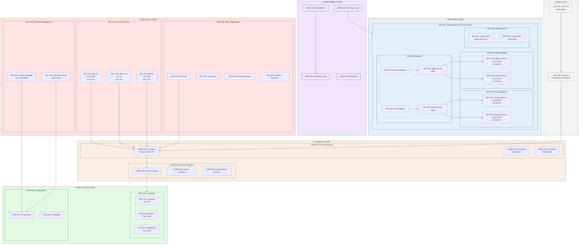
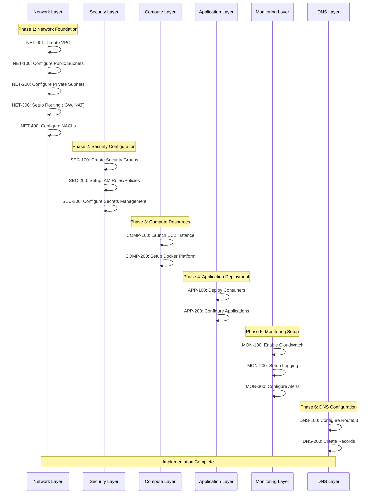

## Architecture Diagrams

### Infrastructure Architecture

### Deployment Workflow

The infrastructure architecture diagram shows the AWS components and their relationships within the deployment, including:
- VPC and subnet configuration
- EC2 instance with Docker containers
- Security group rules
- Network components (IGW, NAT, Route Tables)
- DNS configuration

The deployment workflow diagram illustrates the sequential steps of the deployment process:
1. Initial script execution
2. Security group creation
3. EC2 instance launch
4. System configuration
5. Docker setup
6. Application deployment
7. DNS configuration

These visual representations help understand both the static infrastructure and the dynamic deployment process of the TwentyCRM development environment.
