# TwentyCRM Infrastructure Documentation

## Table of Contents
1. [Overview](#overview)
2. [Infrastructure Architecture](#infrastructure-architecture)
3. [Component Specifications](#component-specifications)
4. [Network Architecture](#network-architecture)
5. [Security Architecture](#security-architecture)
6. [Monitoring and Backup](#monitoring-and-backup)
7. [Scaling Patterns](#scaling-patterns)
8. [CI/CD Pipeline](#cicd-pipeline)
9. [Failure Recovery](#failure-recovery)
10. [Implementation Guide](#implementation-guide)
11. [Troubleshooting](#troubleshooting)

## Overview

TwentyCRM is deployed across three environments:
- Development (mGenialDev.olhai.app.br)
- QA (mGenialQA.olhai.app.br)
- Production (mGenial.olhai.app.br)

### Environment Specifications

| Component | Development | QA | Production |
|-----------|------------|-------|------------|
| VPC CIDR | 10.0.0.0/16 | 10.1.0.0/16 | 10.2.0.0/16 |
| Frontend Nodes | t3.medium x2 | t3.medium x2 | t3.large x3 |
| Backend Nodes | t3.large x2 | t3.large x2 | t3.xlarge x3 |
| Database | t3.large 50GB | t3.large 50GB | t3.xlarge 100GB |

## Infrastructure Architecture

```mermaid
graph TB
    USERS((Internet Users)) --> DEV_R53 & QA_R53 & PROD_R53

    subgraph DEV["DEVELOPMENT - mGenialDev.olhai.app.br"]
        DEV_R53["DNS-101: Route53 Zone"] --> DEV_ACM["DNS-102: ACM SSL"]
        DEV_ACM --> DEV_ALB["ALB-101: Load Balancer"]
        
        subgraph DEV_VPC["VPC-101: Dev VPC (10.0.0.0/16)"]
            DEV_IGW["NET-101: Internet Gateway"]
            DEV_NAT["NET-102: NAT Gateway"]
            
            subgraph DEV_NET["NET-200: Network"]
                DEV_PUB1["NET-201: Public-1A<br/>10.0.1.0/24"]
                DEV_PUB2["NET-202: Public-1B<br/>10.0.2.0/24"]
                DEV_PRIV1["NET-203: Private-1A<br/>10.0.3.0/24"]
                DEV_PRIV2["NET-204: Private-1B<br/>10.0.4.0/24"]
            end

            subgraph DEV_EKS["EKS-100: Dev Cluster"]
                DEV_CP["EKS-101: Control Plane"]
                subgraph DEV_NODES["EKS-200: Node Groups"]
                    DEV_FNG["Frontend Nodes<br/>t3.medium x2"]
                    DEV_BNG["Backend Nodes<br/>t3.large x2"]
                end
            end

            subgraph DEV_DB["DB-100: Database"]
                DEV_EC2["EC2 t3.large"]
                DEV_PG["PostgreSQL 13"]
                DEV_VOL["GP3 50GB"]
            end
        end
    end

    subgraph QA["QA - mGenialQA.olhai.app.br"]
        QA_R53["DNS-201: Route53 Zone"] --> QA_ACM["DNS-202: ACM SSL"]
        QA_ACM --> QA_ALB["ALB-201: Load Balancer"]
        
        subgraph QA_VPC["VPC-201: QA VPC (10.1.0.0/16)"]
            QA_IGW["NET-201: Internet Gateway"]
            QA_NAT["NET-202: NAT Gateway"]
            
            subgraph QA_NET["NET-300: Network"]
                QA_PUB1["NET-301: Public-1A<br/>10.1.1.0/24"]
                QA_PUB2["NET-302: Public-1B<br/>10.1.2.0/24"]
                QA_PRIV1["NET-303: Private-1A<br/>10.1.3.0/24"]
                QA_PRIV2["NET-304: Private-1B<br/>10.1.4.0/24"]
            end

            subgraph QA_EKS["EKS-400: QA Cluster"]
                QA_CP["EKS-401: Control Plane"]
                subgraph QA_NODES["EKS-500: Node Groups"]
                    QA_FNG["Frontend Nodes<br/>t3.medium x2"]
                    QA_BNG["Backend Nodes<br/>t3.large x2"]
                end
            end

            subgraph QA_DB["DB-200: Database"]
                QA_EC2["EC2 t3.large"]
                QA_PG["PostgreSQL 13"]
                QA_VOL["GP3 50GB"]
            end
        end
    end

    subgraph PROD["PRODUCTION - mGenial.olhai.app.br"]
        PROD_R53["DNS-301: Route53 Zone"] --> PROD_ACM["DNS-302: ACM SSL"]
        PROD_ACM --> PROD_ALB["ALB-301: Load Balancer"]
        
        subgraph PROD_VPC["VPC-301: Prod VPC (10.2.0.0/16)"]
            PROD_IGW["NET-301: Internet Gateway"]
            PROD_NAT["NET-302: NAT Gateway"]
            
            subgraph PROD_NET["NET-400: Network"]
                PROD_PUB1["NET-401: Public-1A<br/>10.2.1.0/24"]
                PROD_PUB2["NET-402: Public-1B<br/>10.2.2.0/24"]
                PROD_PRIV1["NET-403: Private-1A<br/>10.2.3.0/24"]
                PROD_PRIV2["NET-404: Private-1B<br/>10.2.4.0/24"]
            end

            subgraph PROD_EKS["EKS-700: Prod Cluster"]
                PROD_CP["EKS-701: Control Plane"]
                subgraph PROD_NODES["EKS-800: Node Groups"]
                    PROD_FNG["Frontend Nodes<br/>t3.large x3"]
                    PROD_BNG["Backend Nodes<br/>t3.xlarge x3"]
                end
            end

            subgraph PROD_DB["DB-300: Database"]
                PROD_EC2["EC2 t3.xlarge"]
                PROD_PG["PostgreSQL 13"]
                PROD_VOL["GP3 100GB"]
            end
        end
    end

    classDef dev fill:#E6F3FF,stroke:#3182CE
    classDef qa fill:#C6F6D5,stroke:#38A169
    classDef prod fill:#FED7D7,stroke:#E53E3E

    class DEV,DEV_VPC,DEV_NET,DEV_EKS,DEV_DB dev
    class QA,QA_VPC,QA_NET,QA_EKS,QA_DB qa
    class PROD,PROD_VPC,PROD_NET,PROD_EKS,PROD_DB prod
```

[Would you like me to continue with the next sections? There's quite a bit more to cover, including:
1. Network Flow Diagrams
2. Security Configuration
3. Monitoring Setup
4. Implementation Instructions
5. Troubleshooting Guide]
