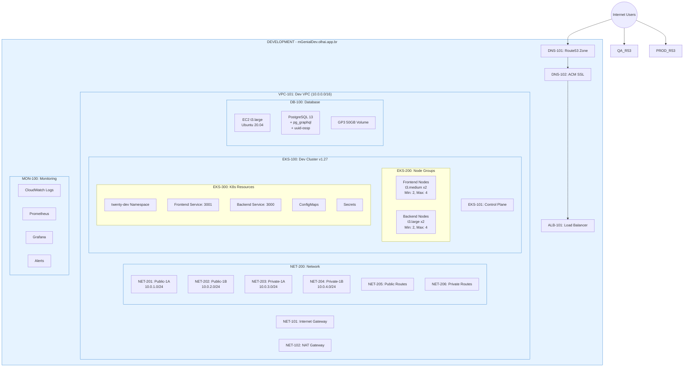
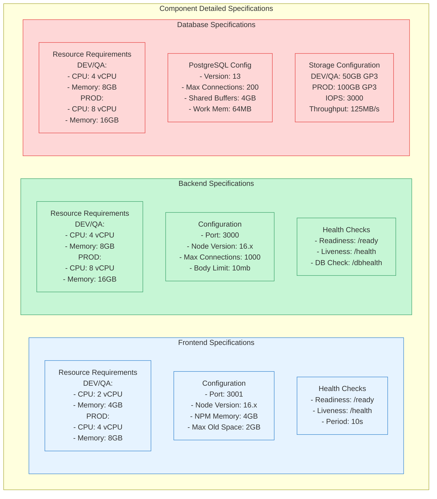

# TwentyCRM Architecture Documentation

## Table of Contents
1. [Infrastructure Overview](#infrastructure-overview)
2. [Component Specifications](#component-specifications)
3. [Network Flow Patterns](#network-flow-patterns)
4. [Monitoring and Backup](#monitoring-and-backup)
5. [Security Configuration](#security-configuration)
6. [Scaling Patterns](#scaling-patterns)
7. [CI/CD Pipeline](#cicd-pipeline)
8. [Failure Recovery](#failure-recovery)
9. [Subsystem Configuration](#subsystem-configuration)

## Infrastructure Overview

## Component Specifications

[Continue with other diagrams...]

Would you like me to:
1. Continue with the remaining diagrams?
2. Add configuration examples?
3. Add implementation instructions?
4. Add troubleshooting guides?
